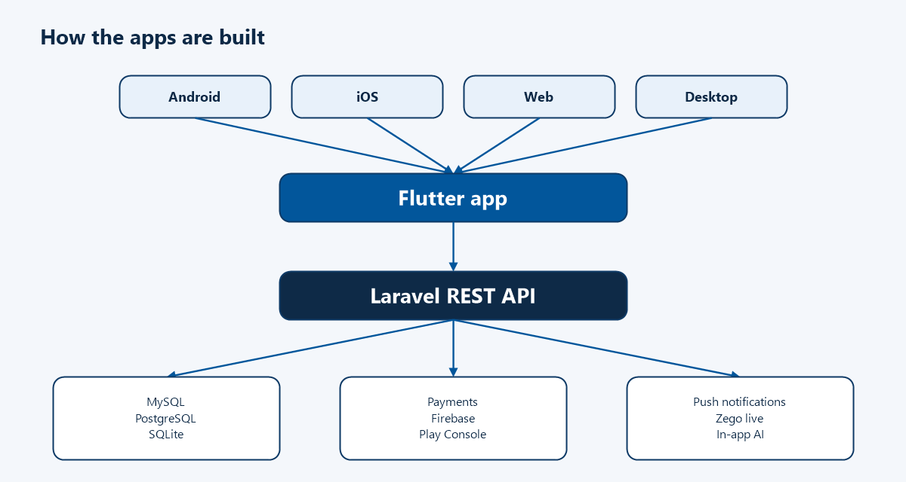
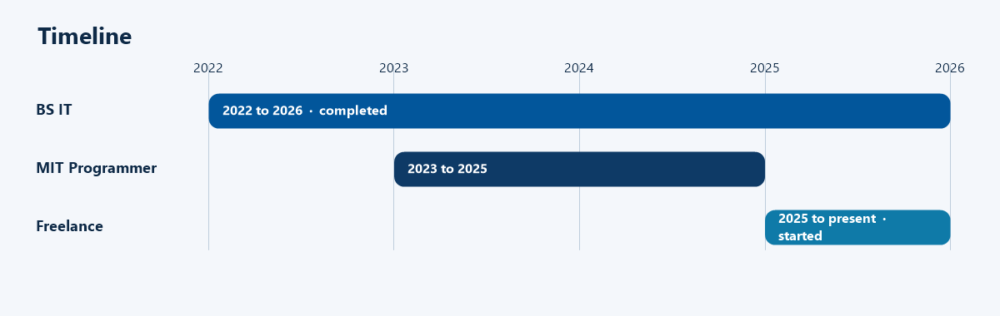
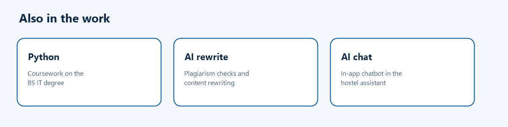

  

  
  
  

Flutter developer with 3 years building Android, iOS, web, and desktop apps. Builds Laravel REST APIs for SaaS products and integrates those Laravel REST APIs into Flutter mobile apps. Payment gateways, push notifications, Firebase, and Google Play Console. Remote work on a Zego live e-commerce app and Blisssify. AI features include content rewriting and an in-app chatbot.

  

  

  

## Experience

### Freelance Flutter Developer · Remote · 2025 – Present

- **Live E-Commerce Social App** — Flutter and Laravel, Zego live streaming, real-time chat, in-app purchases, payment gateways, Android and iOS.
- **[Blisssify](https://github.com/TheCode-Warrior/blisssify-docs)** — Flutter app for Android and iOS, Laravel REST APIs, and deep linking.

### MIT Programmer · Faisalabad, Pakistan · 2023 – 2025

- Built Flutter apps and Laravel REST APIs for SaaS products across Android, iOS, web, and desktop using Bloc, GetX, and Provider.
- Designed REST APIs with MySQL, PostgreSQL, and SQLite. Delivered a restaurant management SaaS and a POS SaaS. Firebase Auth, Firestore, push notifications, JavaScript and TypeScript, and Google Play Console.

## Technical skills

  
  
  
  
  
  

  
  
  
  

REST APIs · payment gateways · push notifications (FCM) · deep linking · Zego · AI integration · Google Play Console · Android · iOS · web · desktop

## Selected projects

| Project | What it does |
| --- | --- |
| [Blisssify](https://github.com/TheCode-Warrior/blisssify-docs) | Flutter app for Android and iOS, with Laravel REST APIs and deep linking. |
| Hiddency VPN | Flutter VPN client with secure tunneling, multiple server regions, and one-tap server switching. |
| No Ulez | Flutter app that helps UK drivers check ULEZ compliance with a live map, vehicle lookup, and zone detection. |
| [Plagiarism Remover Pro](https://play.google.com/store/apps/details?id=com.mit.plagremoverpro) | AI plagiarism detection and content rewriting with subscription billing. |
| [Smart Hostel Management Assistant](https://github.com/TheCode-Warrior/Smart-Hostel-Management-Assistant) | Flutter, Firebase, and Provider, with an AI chatbot. Covers students, rooms, fees, attendance, and complaints. |
| Restaurant Management System | Laravel and MySQL SaaS for orders, table booking, and multi-location billing. |
| POS SaaS | Laravel and MySQL for billing, inventory, and multi-location sales reporting. |

## Education

**Bachelor of Science in Information Technology** · GC University Faisalabad · Completed, 2022 – 2026

Coursework: Web Development, Python, MySQL, Oracle Database, SQL stored procedures and triggers, Cloud Computing, CCNA.

## GitHub stats

  
  

